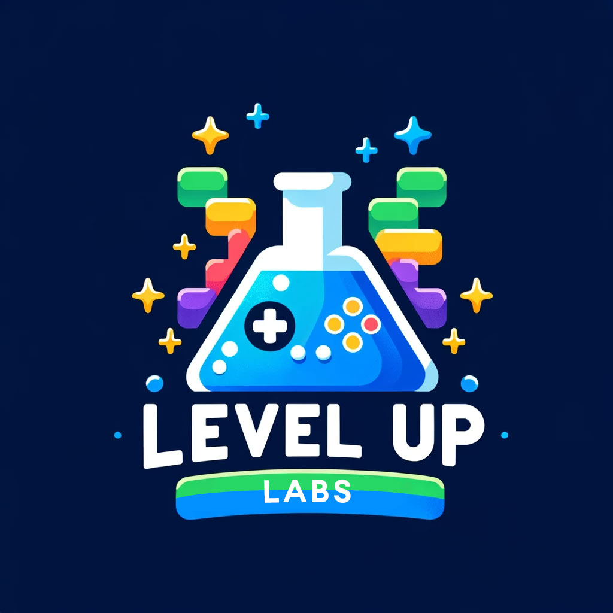
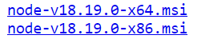
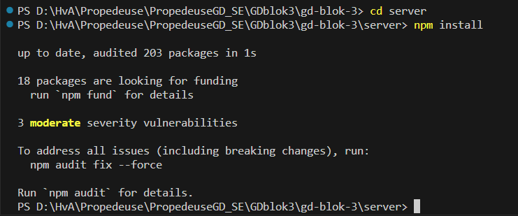
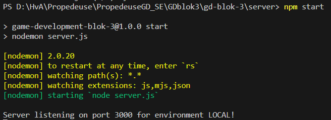

# GD Blok 3 - Bullet Heaven/Hell

### 📚 Opdrachtomschrijving 

De Opdrachtomschrijving vind je dit blok op DLO.

    

### 🛠️ Installatie 

Volg onderstaande stappen om het project op jouw PC te kunnen draaien.

- Installeer de laatste LTS (Long-Term Support) versie van [NodeJS](https://nodejs.org/en) voor jouw OS. Als je een Mircosoft systeem gebruikt, is het handig om de MSI (Microsoft Installer) te downloaden.

- Installeer .NET 8 voor jouw OS vanaf [deze webpagina](https://dotnet.microsoft.com/en-us/download/dotnet/8.0) - Installeer de SDK aan de linkerkant, niet de runtime!
- Clone de repository
- Open de repository als folder in VSCode, zorg ervoor dat je zowel de `game` als `server` folder ziet, anders werkt de aangeleverde configuratie niet correct.
- Installeer de aangerade [VSCode extension](https://marketplace.visualstudio.com/items?itemName=ms-dotnettools.csdevkit) "C# Dev Kit".
- In VSCode, druk op cmd/ctrl + ` om je terminal te openen. Je kan ook naar Terminal > New Terminal gaan.
- In het terminal, change directory (cd) naar server (zie afbeelding hieronder):  
    cd server  

- Typ `npm install` om alle code te installeren waar de server van afhankelijk is.

  

- Als dit gedaan is, typ `npm start` in het terminal om de server op te starten.

  

- Druk op F5 (of in het menu Run > Start Debugging) om te controleren of de game compiled en opstart.
- Als het goed is, werkt de game nu en connect deze naar de server.
- Je kan dit controleren door in de terminal naar de Node console te gaan. Hier zou nu iets moeten staan als  
	`Server listening on port 3000 for environment LOCAL!`  
	`bc3d08a00e69b286b6b1232470acdd56 connected`  
 

Extra:
- Via Terminal > Run Task... kun je de "MonoGame Content Builder" opstarten. Voor meer informatie over deze tool kan je de volgende [link](https://docs.monogame.net/articles/getting_started/content_pipeline/index.html) volgen.